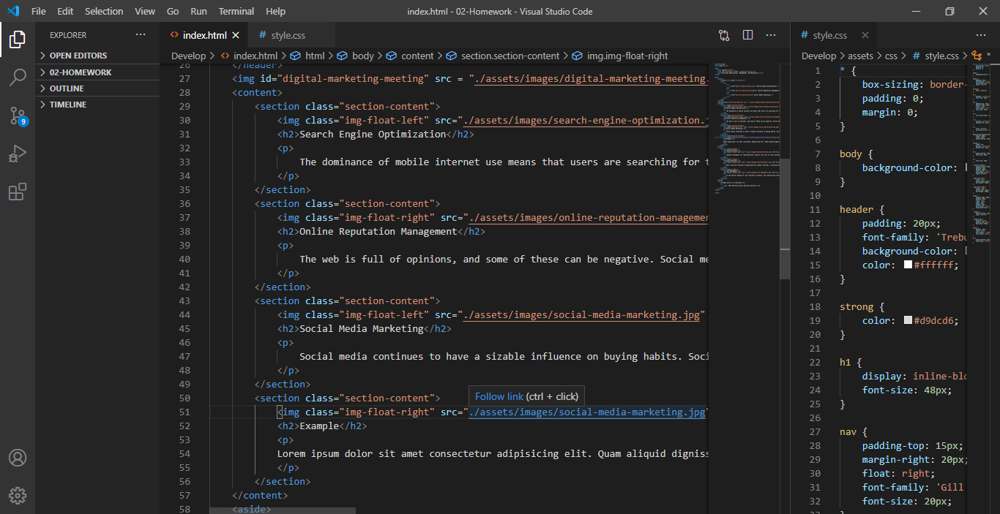
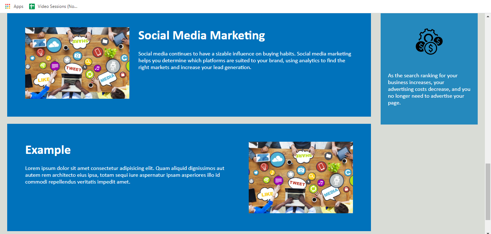

# Week-2-Refactored

### Description
In this project I took a complex and overworked, but working code and made it more simple and cohesive, and still completely functional. I was motivated to do this project so that I could test my skill sets and learn more about the functions of both HTML and CSS. Some of the challenges I faced while doing this project were that the original code was not organized; it follow the basic syntax structures of HTML and CSS. In reworking the code, I made everything more simple so that it could easily be read by other developers as well as non-developers. Hope you enjoy!

---

### Table of Contents
* [Installation](#Installation) 
* [Usage](#Usage)  
* [Credits](#Credits)  
* [Badges](#Badges)  
* [License](#License)

---

### Installation 
To install this code simply clone it in gitbash and download it to your remote server. Visual Studio Code is the application I used to be able to read and test the files. 

---

### Usage  
To demonstrate the code's functionality and accessibility I have included screenshots. The CSS is compatible with an endless amount of variations made to the HTML document. I have added extra sections to the content and the sidebar to demonstrate this.

---

### Links
Below is an example of how the web page looked prior to reworking and below that 
is a link to the deployed web page with the updated code. 

 <a href = "https://mbennett1991.github.io/Week-2-Refactored/02-Homework/Develop/">Click Me!</a>
 
---
  
### Credits
@ChiggyO

---

### Badges 

---

### License 
© 2020 Trilogy Education Services, a 2U, Inc. brand. All Rights Reserved.